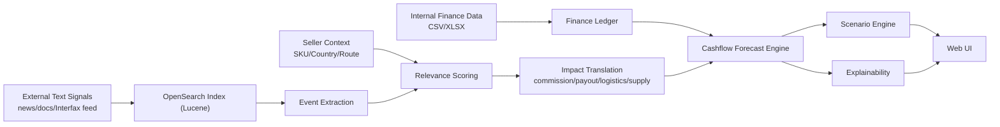

# SellerCash

> **Liquidity Intelligence для продавцов маркетплейсов**: прогноз денежного остатка на 30-60 дней, раннее предупреждение кассового разрыва и сценарии управленческих действий с учетом внешних текстовых сигналов (документы, регламенты, новости, Interfax-like потоки).

## 1. Название

**SellerCash**

## 2. Цель

Разработать сервис для **снижения риска кассового разрыва** у продавцов маркетплейсов за счет объединения:

- финансового прогнозирования денежных потоков;
- сценарного моделирования управленческих решений;
- анализа внешних неструктурированных сигналов (Lucene-based контур).

## 3. Проблема

Для селлера ключевой риск лежит не в бухгалтерской прибыли, а в операционной ликвидности. Бизнес может быть прибыльным в отчете, но не иметь денег «в моменте» на закупку, рекламу, логистику и удержания.

Причина: **рассогласование потоков во времени**.

- деньги на закупки и часть расходов уходят заранее;
- выплаты маркетплейса приходят позже и с удержаниями;
- возвраты и штрафы приходят с лагом;
- часть шоков приходит не в таблицах, а в текстах (новости, тарифы, регламенты).

Итог: классические дашборды по выручке не дают ответ на главный вопрос управленца: **когда и почему касса уйдет в минус, и что делать заранее**.

## 4. Значимость

### Теоретическая

SellerCash объединяет в едином контуре три класса методов: cashflow-моделирование, сценарный анализ и извлечение экономических событий из текста. Объект прогнозирования - не спрос и не выручка, а **денежный остаток** с лагами выплат, возвратами и удержаниями.

### Практическая

Сервис позволяет:

- обнаружить риск кассового разрыва за 2-4 недели до критической точки;
- объяснить прогноз через драйверы и внешние источники;
- выбрать управленческий сценарий с понятным компромиссом «риск/прибыль».

## 5. Решение

Архитектура SellerCash построена вокруг четырех слоев.

1. **Financial Core**
- импорт и нормализация финансовой ленты (`sales`, `returns`, `ads`, `logistics`, `storage`, `penalty`, `procurement`);
- единый календарь денежных событий.

2. **Seller Context Layer**
- профиль бизнес-контекста: SKU, категория, страна происхождения, поставщик, маршрут, ключевые слова;
- фильтрация информационного шума и выделение релевантных внешних событий.

3. **Knowledge & Signals Layer (Lucene/OpenSearch)**
- индексирование документов и внешних сигналов;
- BM25-поиск по фрагментам;
- извлечение событий: `commission_change_pct`, `logistics_change_pct`, `payout_delay_days`, `supply_disruption`.

4. **Forecast & Scenario Engine**
- baseline cashflow и риск отрицательного остатка;
- what-if сценарии: реклама, цена, сдвиг/объем закупки;
- explainability: драйверы и связь с источниками.

### Сквозная логика (интернет-сигналы и Interfax-like системы)



## 6. Ключевой бизнес-кейс

**Сценарий:** продавец торгует помидорами из Турции, и в поток новостей приходит сообщение: «На границе с Турцией задержаны все фуры с помидорами».

Что делает система:

1. Принимает сигнал через `POST /api/v1/knowledge/signals/ingest`.
2. Извлекает событие `supply_disruption` и признаки (товар, страна, задержка).
3. Проверяет релевантность к профилю селлера (TR + tomato + маршрут).
4. Транслирует в параметры модели (`sales_drop_pct`, `procurement_delay_days`).
5. Пересчитывает cashflow, сдвигает дату минимума остатка и обновляет риск.
6. Показывает сценарии компенсации (снижение ads, перенос закупки и т.д.).

## 7. Технологический стек

- **Backend/API:** Python, FastAPI, SQLAlchemy
- **Data/DB:** PostgreSQL
- **Search (Lucene-based):** OpenSearch
- **Document Storage:** MinIO
- **Observability:** Prometheus + Grafana
- **IAM / Auth:** Keycloak (OIDC, JWT)
- **Analytics:** pandas, numpy
- **Runtime:** Docker Compose
- **Frontend:** Vue 3 + Tailwind (встроенный статический UI)

## 8. Быстрый старт (Docker)

### Требования

- Docker Desktop + Docker Compose

### Запуск

```bash
docker compose up -d --build
```

### Проверка

```bash
curl http://localhost:8080/api/v1/health
```

Ожидаемый ответ:

```json
{"status":"ok"}
```

### Доступы

- Web UI + API root: `http://localhost:8080`
- API base: `http://localhost:8080/api/v1`
- API metrics: `http://localhost:8080/metrics`
- OpenSearch: `http://localhost:9200`
- MinIO API: `http://localhost:9000`
- MinIO Console: `http://localhost:9001`
- Keycloak: `http://localhost:8081` (admin/admin по умолчанию)
- Prometheus: `http://localhost:9090`
- Grafana: `http://localhost:3001` (admin/admin по умолчанию)
- PostgreSQL: `localhost:5432`

### Включение авторизации через Keycloak

По умолчанию backend требует токен (`AUTH_ENABLED=true`).

Чтобы включить/настроить проверку JWT:

1. В `.env` установи:
   - `AUTH_ENABLED=true`
   - `KEYCLOAK_REALM=sellercash`
   - `KEYCLOAK_SERVER_URL=http://keycloak:8080`
   - `KEYCLOAK_ISSUER=http://keycloak:8080/realms/sellercash`
2. Перезапусти сервис:

```bash
docker compose up -d --build api keycloak
```

После этого все `api/v1` эндпоинты, кроме `GET /api/v1/health`, требуют bearer token.

Если нужно временно отключить авторизацию для локальной отладки UI, установи `AUTH_ENABLED=false`.

### UX потока входа

- отдельная страница входа: `http://localhost:8080/login`
- frontend получает токен через backend endpoint `POST /api/v1/auth/token`
- после успешного входа токен сохраняется в `localStorage` и используется для `api/v1` запросов

Такой поток убирает браузерные CORS-проблемы при прямом запросе в Keycloak и решает ошибку вида `Failed to fetch` на login-форме.

### Что импортируется в Keycloak

Realm импортируется из файла [infrastructure/keycloak/sellercash-realm.json](infrastructure/keycloak/sellercash-realm.json):

- `sellercash-web` (public client для UI/ручных тестов),
- `sellercash-api` (bearer-only client для backend),
- `sellercash-service` (confidential client для M2M, `client_secret=sellercash-secret`).
- тестовый пользователь `api_demo / demo123`.

Если нужно заново применить realm-конфиг «с нуля», очисти volume `keycloak-db-data` и подними `keycloak` снова.

## 9. API-карта

| Контур | Endpoint | Назначение |
|---|---|---|
| Health | `GET /api/v1/health` | Проверка доступности |
| Auth | `POST /api/v1/auth/token` | Получение access token (password grant через backend proxy) |
| Finance | `POST /api/v1/finance/import` | Импорт финансовой ленты |
| Finance | `GET /api/v1/finance/events` | Просмотр денежных событий |
| Context | `POST /api/v1/context/items` | Добавление бизнес-контекста |
| Context | `GET /api/v1/context/items` | Список контекста продавца |
| Forecast | `POST /api/v1/cashflow/forecast` | Baseline cashflow + риск |
| Scenario | `POST /api/v1/cashflow/scenario` | What-if расчет |
| Explain | `GET /api/v1/cashflow/explain` | Драйверы прогноза |
| Knowledge | `POST /api/v1/knowledge/documents/upload` | Индексация документа |
| Knowledge | `POST /api/v1/knowledge/documents/from-url` | Индексация по URL |
| Knowledge | `POST /api/v1/knowledge/signals/ingest` | Прием внешнего сигнала |
| Knowledge | `GET /api/v1/knowledge/search` | BM25-поиск по индексу |
| Knowledge | `GET /api/v1/knowledge/events` | Извлеченные события |
| Knowledge | `GET /api/v1/knowledge/impacts` | Релевантные impacts по селлеру |
| Observability | `GET /metrics` | Prometheus-метрики API и доменные счетчики |

Детальные контракты: [docs/API.md](docs/API.md)

## 10. Формат входных финансовых данных

Поддерживаются `CSV/XLS/XLSX`.

Минимально обязательные поля:

- дата события (`event_date` / `date` / `дата`)
- тип события (`event_type` / `type` / `тип`)
- сумма (`amount` / `sum` / `сумма`)

Подробно: [docs/FINANCE_FORMAT.md](docs/FINANCE_FORMAT.md)

## 11. Ключевые метрики результата (MVP)

Ниже только метрики, которые можно подтвердить в рамках текущего MVP и процесса защиты.

| Метрика | Как считается | Целевое значение MVP | Как подтвердить |
|---|---|---|---|
| **Signal-to-Impact Latency (P95)** | Время от `POST /knowledge/signals/ingest` до появления impacts в `GET /knowledge/impacts` | `<= 8 сек` для текстового сигнала до 20 КБ | 30 прогонов, замер timestamp в клиентском скрипте |
| **Event Extraction Coverage (core classes)** | Доля тест-кейсов, где корректно извлечены 4 базовых класса событий | `>= 95%` на контрольном наборе MVP | unit-тесты + контрольный набор текстов (`tests/`) |
| **Relevance Precision@1** | Доля случаев, где top-impact действительно относится к профилю селлера | `>= 0.80` на размеченном наборе кейсов | ручная разметка экспертами, сверка с `knowledge/impacts` |
| **Scenario Feasibility Rate** | Доля кейсов, где сценарий убирает отрицательный минимум при ограничении `profit_delta_pct >= -5%` | `>= 60%` на пилотной выборке | батч-прогон `cashflow/forecast` + `cashflow/scenario` по историческим срезам |

Почему это валидно для MVP: все 4 метрики измеримы уже текущими API, без недоступной внешней инфраструктуры.

## 12. Что уже реализовано

- единая финансовая лента и импорт из таблиц;
- baseline forecast + сценарный расчет;
- knowledge layer с OpenSearch (Lucene);
- извлечение событий из текста;
- relevance + translation в параметры cashflow;
- прием внешних сигналов (включая Interfax-like интеграции);
- мониторинг через Prometheus и Grafana;
- опциональная OIDC-аутентификация через Keycloak;
- explainability и UI-демо в браузере.

## 13. Тесты

```bash
cd backend
python -m pytest ../tests -q
```

## 14. Документы проекта

- [Архитектура](docs/ARCHITECTURE.md)
- [PUML-диаграмма](docs/architecture.puml)
- [API](docs/API.md)
- [Демо-сценарий](docs/DEMO.md)
- [Roadmap](docs/MVP_ROADMAP.md)

## 15. Статус

**Текущий статус:** MVP-1 (архитектурно полный демонстрационный контур).  
**Следующий этап:** MVP-2 - вероятностная калибровка, NER/шаблоны extraction 2.0, гибридный поиск (BM25 + vector), production hardening.
